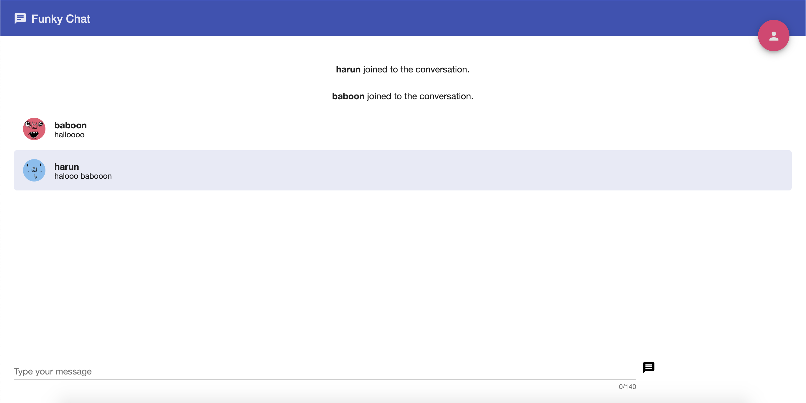
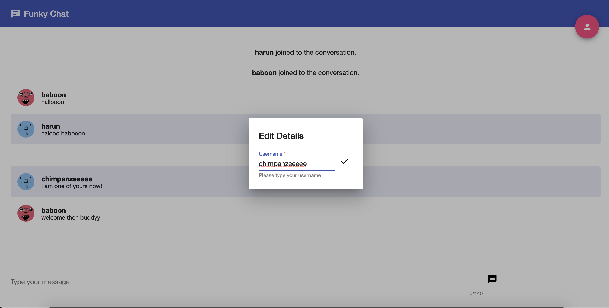
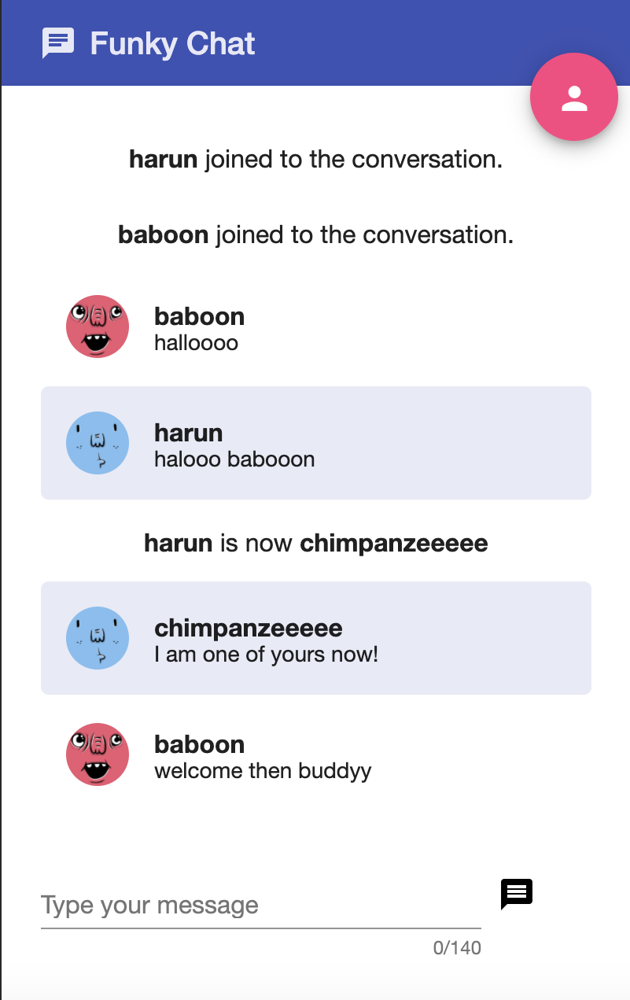

# Funky Chat

Angular 5 Online Chat Application for web browsers. Start chatting with your friends today! (Of course, on the local network only)

## Dependencies

1. NodeJS - Download and Install latest version of Node: [NodeJS](https://nodejs.org/en/)
2. Angular CLI - Install Command Line Interface for Angular: [Angular CLI](https://cli.angular.io/)
3. NPM - Download the latest version of Node Package Manager: [NPM](https://www.npmjs.com/)

## Build & Run

Please, preserve the order below with using two seperated terminal tabs.

* <b> Important Notice: </b> in <code>client/src/app/chat/shared/services/socket.service.ts</code>, there is a line:
  * <code>const SERVER_URL = 'http://0.0.0.0:8080';</code>

Please fill this line with your current IP address ending with ":8080". Then, you can proceed to the following steps.

<h3> Server </h3>

```bash
$ cd server
$ npm install
$ npm start
```

<h3> Client </h3>

```bash
$ cd client
$ npm install
$ npm start
```

## Screenshots

Chat screen



Edit your username



Display on other devices


